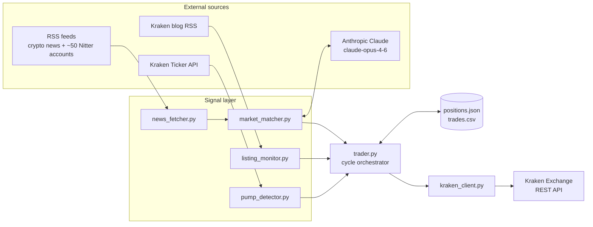

# Kraken Meme Coin Trading Bot 🤖

An automated cryptocurrency trading bot for the Kraken exchange. Trades meme coins and altcoins using AI-powered news analysis, volume spike detection, and new listing monitoring — running 24/7 on a VPS server.

## Features

- **News-based signals** — Uses Claude AI (claude-opus-4-6) to analyze crypto news headlines from 6 RSS feeds and generate buy/sell signals
- **Pump detector** — Identifies coins with 3x+ volume spikes vs. normal (early pump detection)
- **New listing monitor** — Watches Kraken's blog RSS feed and buys coins the moment they list
- **Risk management** — Daily loss limit, per-trade size caps, dry run mode
- **24/7 operation** — Runs as a systemd service on a Linux VPS

## How It Works

Every 5 minutes the bot:
1. Checks your CAD balance and daily loss limit
2. Scans Kraken blog for new coin listings → buys immediately
3. Detects volume spikes across all tradable coins
4. Fetches 60 latest crypto headlines and sends them to Claude AI
5. Combines signals and places market orders on Kraken

## Architecture

Three independent signal sources feed a single decision loop. The trader merges them, applies risk caps and exit logic, and routes orders through one Kraken REST client. Full strategy details live in [STRATEGY.md](STRATEGY.md).



## Setup

### Prerequisites
- Python 3.8+
- Kraken account with API key (trading permissions)
- Anthropic API key

### Install

```bash
git clone https://github.com/YOUR_USERNAME/kraken-bot.git
cd kraken-bot
python3 -m venv venv
source venv/bin/activate
pip install -r requirements.txt
```

### Configure

Create a `.env` file (never commit this):

```env
KRAKEN_API_KEY=your_kraken_api_key
KRAKEN_PRIVATE_KEY=your_kraken_private_key
ANTHROPIC_API_KEY=your_anthropic_api_key
MAX_TRADE_AMOUNT=40.0
MIN_CONFIDENCE=0.65
RUN_INTERVAL_MINUTES=5
DAILY_LOSS_LIMIT=100.0
DRY_RUN=true
```

Set `DRY_RUN=false` to go live.

### Run locally

```bash
source venv/bin/activate
python3 main.py
```

### Deploy to VPS (Linux/Ubuntu)

```bash
# Upload files
scp -r . root@YOUR_SERVER_IP:/root/kraken-bot

# SSH in and install
ssh root@YOUR_SERVER_IP
cd /root/kraken-bot
python3 -m venv venv && source venv/bin/activate
pip install -r requirements.txt
```

Create `/etc/systemd/system/kraken-bot.service`:

```ini
[Unit]
Description=Kraken Meme Coin Trading Bot
After=network.target

[Service]
Type=simple
User=root
WorkingDirectory=/root/kraken-bot
ExecStart=/root/kraken-bot/venv/bin/python main.py
Restart=always
RestartSec=10

[Install]
WantedBy=multi-user.target
```

```bash
systemctl daemon-reload
systemctl enable kraken-bot
systemctl start kraken-bot
```

Check logs:
```bash
journalctl -u kraken-bot -n 50 --no-pager
```

## Project Structure

```
kraken-bot/
├── main.py              # Scheduler — runs every N minutes
├── trader.py            # Main trading logic
├── kraken_client.py     # Kraken API wrapper
├── market_matcher.py    # Claude AI news analysis
├── pump_detector.py     # Volume spike detection
├── listing_monitor.py   # New listing monitor (Kraken blog RSS)
├── news_fetcher.py      # RSS feed fetcher (6 sources)
├── config.py            # Loads .env settings
└── requirements.txt
```

## Daily Iteration

This repo follows a daily iteration discipline. Each day a small, scoped improvement lands as a commit so the bot keeps compounding.

- [DAILY_ITERATIONS.md](DAILY_ITERATIONS.md) holds the 30 task backlog (docs, tests, refactors, observability, features, ops).
- [JOURNAL.md](JOURNAL.md) records what shipped each day.
- Run `./scripts/daily.sh` from the repo root to see today's task.

## Risk Warning

This bot trades real money. Crypto is extremely volatile. Use `DRY_RUN=true` to test before going live. Set conservative `DAILY_LOSS_LIMIT` and `MAX_TRADE_AMOUNT` values. Past performance does not guarantee future results.

## Tech Stack

- Python 3
- [krakenex](https://github.com/veox/python3-krakenex) — Kraken REST API
- [Anthropic Claude API](https://www.anthropic.com) — AI news analysis
- feedparser — RSS ingestion
- schedule — job scheduling
