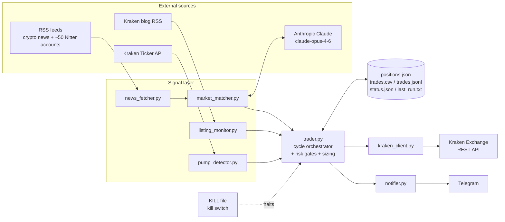

# Kraken Meme Coin Trading Bot 🤖

[](https://github.com/evanoseen/kraken-bot/actions/workflows/test.yml)

An automated cryptocurrency trading bot for the Kraken exchange. Trades meme coins and altcoins using AI-powered news analysis, volume spike detection, and new listing monitoring — running 24/7 on a VPS server.

## Features

**Signals**
- **News-based signals** — Claude AI analyzes crypto news headlines and ~50 high-signal X/Twitter accounts via RSS, returns buy/sell signals with confidence scores
- **Pump detector** — Identifies obscure coins (< $5M daily volume) with 3x+ volume spikes vs. normal, geo-blocked-for-Ontario tickers excluded
- **New listing monitor** — Watches Kraken's blog RSS feed and buys watchlisted coins the moment they list
- **Headline dedup cache** — Skips re-analyzing headlines already seen this session, saving Claude API calls

**Risk management**
- **Confidence-scaled position sizing** — Trade size scales linearly between `MIN_TRADE_AMOUNT` and `MAX_TRADE_AMOUNT` based on signal confidence, not a flat amount
- **Config validation at startup** — Contradictory or out-of-range tunables (e.g. `MIN_TRADE_AMOUNT` above `MAX_TRADE_AMOUNT`) fail loud before the first cycle instead of producing confusing behavior downstream
- **Daily loss limit + drawdown circuit breaker** — Halts trading for the day on either a fixed CAD loss or a percentage drawdown from the session peak
- **Trailing stop** — Optional; locks in gains by exiting on a pullback from the position's peak price, not just a fixed take-profit target
- **Balance reserve floor** — A configurable CAD amount the bot will never trade with
- **Per-coin blacklist, per-coin trade cap, and post-trade cooldown** — Prevents hammering the same ticker across cycles
- **Max open positions + max trades per day** — Hard ceilings independent of signal confidence
- **Min hold time + max position age** — Prevents flip-flopping on a position just entered, and force-exits dead money
- **Kill switch** — `touch KILL` in the repo root halts all trading instantly (next cycle becomes a no-op); `rm KILL` resumes — no restart, no SSH-to-systemctl
- **Dry run mode** — `DRY_RUN=true` logs every decision with zero real orders

**Ops & observability**
- **24/7 operation** — Runs as a systemd service on a Linux VPS, `Restart=always`
- **Telegram alerts** — Fires on every trade, on graceful shutdown with a session summary, when the heartbeat goes stale, and when live Kraken holdings drift from what the bot thinks it holds
- **Heartbeat + status file** — `last_run.txt` and `status.json` answer "is the bot alive, and what's it doing" without SSHing in or parsing logs
- **Positions reconciliation** — Diffs `positions.json` against live Kraken holdings to catch a manual trade, a partial fill, or state corruption before it becomes an incident
- **Structured trade log** — Every trade appended to both `trades.csv` and `trades.jsonl`, with a monthly archive script so neither grows forever
- **Rotating log file + retry/backoff + rate limiting** — `bot.log` caps at 5MB × 5 backups; Kraken API calls retry on transient errors and stay under 1/sec
- **One-command deploy** — `make deploy` tests, rsyncs, restarts the service, and verifies the heartbeat advanced before declaring success
- **CI on every push** — pytest, a `pip-audit` dependency vulnerability scan, and Dependabot-proposed dependency updates
- **Test coverage tracked** — `make coverage`; the whole codebase sits at 98%+ as of Day 81

## How It Works

Every `RUN_INTERVAL_MINUTES` (default 15) the bot:
1. Checks the kill switch, balance, daily loss limit, and drawdown circuit breaker
2. Checks trailing-stop / stop-loss / take-profit / max-age exits on anything currently held
3. Scans Kraken's blog for new coin listings → buys watchlisted coins immediately
4. Detects volume spikes across all tradable coins
5. Fetches new crypto headlines and sends them to Claude AI for signal extraction
6. Merges signals, applies every risk gate (blacklist, cooldown, position caps, sizing), and places market orders

Full stage-by-stage detail, confidence math, and the exact sizing formula live in [STRATEGY.md](STRATEGY.md).

## Architecture

Three independent signal sources feed a single decision loop. The trader merges them, applies risk caps and exit logic, and routes orders through one Kraken REST client. Full strategy details live in [STRATEGY.md](STRATEGY.md).



## Setup

### Prerequisites
- Python 3.8+
- Kraken account with API key (trading permissions)
- Anthropic API key

### Install

```bash
git clone https://github.com/YOUR_USERNAME/kraken-bot.git
cd kraken-bot
python3 -m venv venv
source venv/bin/activate
pip install -r requirements.txt
```

### Configure

```bash
cp .env.example .env
$EDITOR .env
```

Fill in `KRAKEN_API_KEY`, `KRAKEN_PRIVATE_KEY`, and `ANTHROPIC_API_KEY`; everything else has a safe default. [.env.example](.env.example) documents all 26 variables the bot reads — it's kept in exact sync with the code by [tests/test_env_example.py](tests/test_env_example.py), so it's always current.

Set `DRY_RUN=false` to go live, only after watching at least one full dry-run cycle in the logs. Contradictory values (e.g. `MIN_TRADE_AMOUNT` above `MAX_TRADE_AMOUNT`) are rejected at startup with a clear error rather than failing silently mid-cycle.

### Run locally

```bash
source venv/bin/activate
python3 main.py
```

### Deploy to VPS (Linux/Ubuntu)

**First-time setup** — upload the repo, install the venv, and create a systemd unit:

```bash
rsync -av --exclude='.env' --exclude='.git' --exclude='venv' ./ root@YOUR_SERVER_IP:/root/kraken-bot/
ssh root@YOUR_SERVER_IP
cd /root/kraken-bot
python3 -m venv venv && source venv/bin/activate
pip install -r requirements.txt
```

Create `/etc/systemd/system/kraken-bot.service`:

```ini
[Unit]
Description=Kraken Meme Coin Trading Bot
After=network.target

[Service]
Type=simple
User=root
WorkingDirectory=/root/kraken-bot
ExecStart=/root/kraken-bot/venv/bin/python main.py
Restart=always
RestartSec=10

[Install]
WantedBy=multi-user.target
```

```bash
systemctl daemon-reload
systemctl enable kraken-bot
systemctl start kraken-bot
```

**Every deploy after that** — one command from the local repo:

```bash
make deploy
```

Runs the test suite, rsyncs (never touching the server's `.env`), restarts the service, and polls the heartbeat file until it advances or times out — see [OPS_RUNBOOK.md](OPS_RUNBOOK.md) for the full deploy/rollback/incident-response runbook.

Check logs:
```bash
make logs
# or: journalctl -u kraken-bot -n 50 --no-pager
```

## Project Structure

```
kraken-bot/
├── main.py                    # Entry point — CLI flags, scheduler loop, graceful shutdown
├── trader.py                  # Cycle orchestrator — the main trading logic
├── kraken_client.py           # Kraken REST API wrapper (retry + rate limiting)
├── config.py                  # .env → frozen Config dataclass
├── health.py                  # Startup checks — env vars, Kraken connectivity, config banner
│
│   # Signal sources
├── news_fetcher.py            # RSS + Twitter/Nitter headline fetcher
├── market_matcher.py          # Sends headlines to Claude, parses trade signals
├── pump_detector.py           # Volume-spike scanner for obscure coins
├── listing_monitor.py         # Kraken blog RSS → new-listing buys
├── headline_cache.py          # Dedup so repeat headlines skip Claude
│
│   # Risk management
├── blacklist.py               # Coin blacklist
├── cooldown.py                # Post-trade per-coin cooldown
├── coin_trade_counter.py      # Per-coin trade cap
├── signals.py                 # Pump + news signal dedup/merge
├── kill_switch.py             # KILL file check
│
│   # State, logging, and ops
├── positions.py               # positions.json read/write + trade logging
├── trade_logger.py            # Structured JSONL/CSV trade log
├── status.py                  # status.json cycle snapshot
├── heartbeat.py                # last_run.txt liveness file
├── portfolio.py                # Cash + open-position valuation
├── cycle_timer.py              # Per-cycle timing decorator
├── retry.py                    # Exponential backoff for Kraken calls
├── notifier.py                 # Telegram alerts (trades, shutdown, stale heartbeat)
│
├── scripts/
│   ├── daily.sh                 # Prints today's DAILY_ITERATIONS.md task
│   ├── daily_pnl.py             # Per-day PnL report, --since/--until range
│   ├── archive_trades.py        # Rotates old trades.csv/trades.jsonl entries
│   ├── check_heartbeat.py       # Telegram alert if the heartbeat goes stale (run off-VPS)
│   ├── reconcile_positions.py   # Diffs positions.json against live Kraken holdings (run on-VPS)
│   └── deploy.sh                # test → rsync → restart → verify heartbeat
│
├── tests/                        # 52 test files / 466 tests, run with `make test` / `pytest`
├── Makefile                      # help/test/coverage/run/dry/deploy/logs/restart/status
├── .coveragerc                   # Coverage scope — excludes tests/, venv/, site-packages
├── .github/workflows/test.yml    # CI: pytest + pip-audit on every push
├── .github/dependabot.yml        # Weekly grouped dependency update PRs
└── requirements.txt
```

Docs: [STRATEGY.md](STRATEGY.md) (signal + sizing detail), [OPS_RUNBOOK.md](OPS_RUNBOOK.md) (deploy/incident response), [SECURITY.md](SECURITY.md) (threat model), [ISA.md](ISA.md) (project spec).

## Daily Iteration

This repo follows a daily iteration discipline. Each day a small, scoped improvement lands as a commit so the bot keeps compounding.

- [DAILY_ITERATIONS.md](DAILY_ITERATIONS.md) holds the task backlog (docs, tests, refactors, observability, features, ops) — now well past its original 30, extended as of Day 55.
- [JOURNAL.md](JOURNAL.md) records what shipped each day.
- Run `./scripts/daily.sh` from the repo root to see today's task.

## Risk Warning

This bot trades real money. Crypto is extremely volatile. Use `DRY_RUN=true` to test before going live. Set conservative `DAILY_LOSS_LIMIT` and `MAX_TRADE_AMOUNT` values. Past performance does not guarantee future results.

## Tech Stack

- Python 3
- [krakenex](https://github.com/veox/python3-krakenex) — Kraken REST API
- [Anthropic Claude API](https://www.anthropic.com) — AI news analysis
- feedparser — RSS ingestion
- schedule — job scheduling
- tenacity — retry/backoff on Kraken API calls
- requests — Telegram + Kraken connectivity check
- python-dotenv — `.env` loading
- pytest / pytest-mock / pytest-cov — 52 test files (466 tests), run in CI on every push
- pip-audit — dependency vulnerability scanning in CI
- Dependabot — weekly grouped dependency update PRs
- mypy — type checking locked on `kraken_client.py`, `trader.py`, `config.py`, `notifier.py`, `status.py`, and `blacklist.py`
