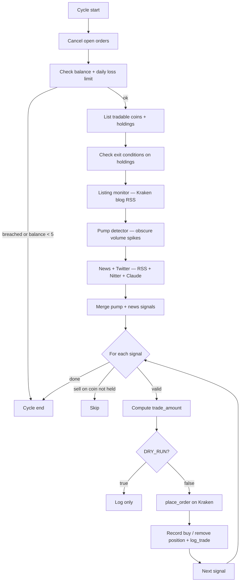

# Trading Strategy

This document explains what the kraken-bot actually does on each cycle, what it measures, how it decides, and what it deliberately ignores. Everything here is grounded in the code that ships in this repo; file and function references point at the source of truth.

---

## TL;DR

Every `RUN_INTERVAL_MINUTES` (default 15) the bot runs one trading cycle. A cycle has six stages: free funds, gate checks, exit checks on holdings, three signal sources, signal merge, and order placement. Three independent signal generators feed a single decision loop: a Kraken blog listing watch (`listing_monitor.py`), an obscure-volume pump detector (`pump_detector.py`), and an LLM-driven news and Twitter analyzer (`news_fetcher.py` plus `market_matcher.py`). Exits are governed by fixed stop-loss and take-profit percentages off the recorded entry price. Position sizing is a function of signal confidence, configured per-trade caps, and available balance.

---

## Signal sources

The bot does not try to predict markets from price data alone. It listens for catalysts: new Kraken listings, anomalous volume on obscure tickers, and high-signal social or news mentions. Three modules generate signals; the trader merges them.

### 1. New-listing signal — `listing_monitor.py`

**What it watches.** The Kraken blog RSS feed (`https://blog.kraken.com/feed`), entries titled with `NOW AVAILABLE`, `LISTING`, `LAUNCHES`, or `TRADING NOW`.

**What it measures.** Whether a coin in the curated `WATCHLIST` set (currently `DOGS, GOAT, FWOG, PNUT, MOODENG, NEIRO, COW, HYPER`) appears in a fresh listing announcement.

**What it emits.** A list of coin tickers to buy immediately on this cycle.

**Why it works.** New Kraken listings reliably produce a 24-hour pump as the coin becomes accessible to Canadian and US retail traders. Being on the listing day's first cycle, not the day after, captures most of that move.

**State.** Seen listings are persisted to `seen_listings.json` so the same announcement does not fire twice.

**Limits.** The watchlist is hand-curated; coins outside it are logged but not bought. Generic listing announcements without a watchlist match log a notice and continue.

### 2. Obscure-pump signal — `pump_detector.py`

**What it watches.** Every CAD-quoted Kraken pair (full `Ticker` and `AssetPairs` snapshot per cycle).

**What it measures.** Volume spike ratio (`volume_today / (volume_24h / 24)`) and price move off the 24-hour low. A pair qualifies when:
- Average daily USD volume is **below $5,000,000** (`pump_detector.py:65`) — the bot deliberately hunts unknown coins, not already-discovered ones
- Volume spike ratio ≥ `min_volume_multiplier` (default `3.0` in `trader.py:125`, fallback `2.0` in the function default)
- Price is up `>1.0%` off the 24h low
- The coin is not in `IGNORE_COINS` — majors, stablecoins, known memes, and Ontario-geo-blocked tokens are excluded

**What it emits.** Up to `top_n=5` candidates sorted by spike size, each with `coin, pair, price, volume_spike, price_change_24h, daily_volume_usd, trades_today`.

**Confidence math (in `trader.py:130`).**
```
confidence = min(0.65 + (volume_spike / 50), 0.95)
```
A 5x spike maps to 0.75 confidence. A 25x spike maps to 0.95 (the ceiling). The 0.65 floor is below `MIN_CONFIDENCE` default of 0.80, which means small spikes get logged but filtered out downstream unless the user lowers `MIN_CONFIDENCE`.

**Why it works.** A 3x intraday volume surge on a coin that normally does less than $5M a day is hard to fake organically and usually precedes a coordinated pump in retail Telegram and Discord groups. By the time the move shows on Twitter or in financial news, the bot has already entered.

**Limits.** The strategy is asymmetric on entry (looks for breakouts) but symmetric on exit (uses the same fixed percentages as every other signal). The detector does not measure liquidity depth, only daily volume, so thin order books can produce false positives.

### 3. News and social signal — `news_fetcher.py` + `market_matcher.py`

**What it watches.** A blended feed of:
- Six general crypto and meme RSS feeds (Cointelegraph, Decrypt, CoinDesk, Google News crypto query, Google News meme-coin query, Google News Elon-and-Doge query)
- Up to ~50 high-signal accounts on X via Nitter RSS, including market movers (Elon Musk, Trump, Saylor, Kiyosaki), exchange announcement accounts (CoinbaseAssets, Binance, Kraken), exchange CEOs (CZ, Brian Armstrong, Jesse Powell), protocol founders (Vitalik, Justin Sun, Charlie Lee), top callers (APompliano, CryptoCobain, CryptoWendyO, others), and threat-intel handles (PeckShieldAlert, zachxbt)
- Three Nitter instances with automatic failover (`nitter.poast.org`, `nitter.privacydev.net`, `nitter.1d4.us`)

**What it measures.** The fetched titles are concatenated and sent to Claude (`claude-opus-4-6` per `market_matcher.py:41`) with the full list of Kraken-tradable coins. Claude is prompted to find headlines that will cause "significant short-term price moves" and return a JSON array of `{coin, action, confidence, reasoning}` objects.

**What it emits.** Only items where `confidence >= MIN_CONFIDENCE` (default `0.80`) survive the local filter.

**Why it works.** A celebrity tweet, an exchange listing announcement, or a credible exploit alert moves markets faster than any technical pattern can react. Delegating recognition to a frontier LLM means the bot does not need to maintain its own NER model, sentiment classifier, or relevance scorer.

**Limits.** Claude is single-shot per cycle, so signals are at best `RUN_INTERVAL_MINUTES` stale. The JSON parser strips a single fenced code block but does not handle malformed output beyond that. Cost per cycle scales with article count (currently capped at 60 in `fetch_top_headlines`).

---

## The trading cycle

The full cycle lives in `trader.py:run_trading_cycle`. The order is fixed and matters.



### Stage details

**1. Free funds.** Open orders left from previous cycles are cancelled to free CAD that might otherwise be locked.

**2. Balance and daily-loss gate.** Balance is fetched once. On the first cycle of a session, `_starting_balance` is captured. If `_starting_balance - current_balance >= DAILY_LOSS_LIMIT` (default `100 CAD`), the cycle exits immediately. If balance is under `$5`, the cycle skips.

**3. Holdings and exit checks.** For each held coin, `check_exit_conditions` (in `trader.py:15`) compares current price against the recorded entry price. Two thresholds apply:
- **Stop loss** at `pct_change <= -STOP_LOSS_PCT` (default `-10%`). Triggers a market sell of the full position, logs the realized PnL, removes the position.
- **Take profit** at `pct_change >= TAKE_PROFIT_PCT` (default `+25%`). Same mechanics on the upside.
Exits log structured PnL even in dry-run mode.

**4. Listing scan.** `listing_monitor.check_new_listings` returns watchlist matches. For each match, the bot computes `trade_amount = min(MAX_TRADE_AMOUNT, balance * 0.3)`, fetches the current price, and places a buy. Listing buys get the highest budget ceiling (30% of balance) because they're the most reliable signal.

**5. Pump scan.** `find_pumping_coins` returns up to five candidates. Each becomes a pump-signal record with confidence derived from the spike size formula above.

**6. News scan.** `fetch_top_headlines` returns up to 60 items (Twitter prepended, RSS appended). `analyze_news_for_trades` sends them to Claude and returns filtered signals.

**7. Signal merge and placement.** Pump and news signals are concatenated. For each:
- Sells on coins not currently held are skipped (`trader.py:159`).
- Price is fetched per coin; coins without a price quote are skipped.
- Position size is `min(size_position(confidence), balance * 0.25)` — see "Position sizing and confidence math" below for `size_position`. The 25% balance cap is tighter than the listing buy's 30% — listing signals are trusted more.
- In dry-run mode, the trade is logged only. Otherwise `place_order` is called, and on success, `record_buy` or `log_trade` (sell branch) persists the position state.

---

## Position sizing and confidence math

| Signal type | Per-trade size formula | Balance cap | Confidence source |
|-------------|------------------------|-------------|-------------------|
| Listing | `min(MAX_TRADE_AMOUNT, balance * 0.3)` | 30% | implicit (no filter) |
| Pump | `min(size_position(confidence), balance * 0.25)` | 25% | `min(0.65 + spike/50, 0.95)` |
| News | `min(size_position(confidence), balance * 0.25)` | 25% | Claude output ∩ `>= MIN_CONFIDENCE` |

`MAX_TRADE_AMOUNT` is read from `.env` (default `40 CAD` per the live deployment, `25 CAD` per the code's hardcoded fallback).

### `size_position` — confidence-scaled sizing (Day 62)

Before Day 62, position size was `MAX_TRADE_AMOUNT * confidence` — a multiplier with no floor tied to `MIN_TRADE_AMOUNT` and no explicit relationship to the confidence range that actually reaches the sizing code (signals below `MIN_CONFIDENCE` are already filtered out upstream, so the multiplier's effective domain was `[MIN_CONFIDENCE, 1.0]`, not `[0, 1]`, even though it was written as if it were).

`size_position` (`trader.py`) replaces it with an explicit linear map over that real domain:

```
t = clamp((confidence - MIN_CONFIDENCE) / (1.0 - MIN_CONFIDENCE), 0, 1)
size = MIN_TRADE_AMOUNT + t * (MAX_TRADE_AMOUNT - MIN_TRADE_AMOUNT)
```

A signal right at the confidence floor (`confidence == MIN_CONFIDENCE`) sizes the minimum trade. A maximum-confidence signal (`confidence == 1.0`) sizes the maximum. Confidence in between scales linearly. The clamp is defensive — nothing upstream should hand `size_position` a confidence outside `[MIN_CONFIDENCE, 1.0]`, but the function doesn't trust that silently.

Worked example at the code defaults (`MIN_CONFIDENCE=0.80`, `MIN_TRADE_AMOUNT=1.0`, `MAX_TRADE_AMOUNT=25.0`):

| Confidence | `t` | Trade size |
|------------|-----|------------|
| 0.80 (floor) | 0.00 | $1.00 |
| 0.81 | 0.05 | $2.20 |
| 0.90 | 0.50 | $13.00 |
| 0.99 | 0.95 | $23.80 |
| 1.00 | 1.00 | $25.00 |

The `balance * 0.25` cap in the table above still applies on top of `size_position` — a maxed-out confidence signal on a small account is still capped by available balance, not just by `MAX_TRADE_AMOUNT`.

---

## Exit logic

Exits are mostly not signal-driven. A position closes on a fixed threshold (stop-loss, take-profit, trailing stop, or max age) or, for coins the bot currently holds, a fresh LLM sell signal — there's no manual sell-on-counter-signal beyond that, and the news layer cannot emit a sell on a coin already held that gets cleared purely on its own merits.

| Trigger | Condition | Action |
|---------|-----------|--------|
| Trailing stop (Day 69, opt-in) | Peak price since entry has moved above entry, AND `(peak_price - price) / peak_price >= TRAILING_STOP_PCT` | Market sell full position, log `sell_trailingstop`, remove position |
| Stop loss | `(price - entry_price) / entry_price <= -STOP_LOSS_PCT` (default `-10%`) | Market sell full position, log `sell_stoploss`, remove position |
| Take profit | `(price - entry_price) / entry_price >= TAKE_PROFIT_PCT` (default `+25%`) | Market sell full position, log `sell_takeprofit`, remove position |
| Max age (Day 31) | Position held ≥ `MAX_POSITION_AGE_HOURS` (default `24h`), checked before all of the above | Market sell full position, log `sell_stale`, remove position |
| News-driven sell | LLM emits `action: "sell"` for a held coin | Market sell, log `sell_signal`, remove position |

### Trailing stop vs. fixed stop-loss/take-profit (Day 69)

`TRAILING_STOP_PCT` is unset by default — with it unset, behavior is unchanged from before Day 69: only the fixed stop-loss and take-profit thresholds apply, both measured off the entry price.

When set, `trader.check_exit_conditions` tracks the highest price seen since entry (`peak_price`, persisted in `positions.json` via `positions.update_peak_price`) and checks the trailing-stop condition **before** the fixed stop-loss/take-profit check, in the same pass:

- **Only evaluated once the peak has moved above entry.** A position that has only ever gone down has `peak_price == entry_price`, so the trailing-stop check is skipped entirely and falls through to the ordinary entry-price stop-loss — this avoids the trailing stop silently becoming a second, differently-thresholded stop-loss for a position that never ran up.
- **Can fire while a position is still net profitable.** A coin that ran up 20% and has since given back 8% off that peak is still +10.4% vs. entry — well inside the default 10% stop-loss band — but the trailing stop exits it anyway, locking in the gain instead of waiting to see if the fixed stop-loss or take-profit eventually catches it.
- **Takes priority over stop-loss/take-profit when it fires.** If the trailing-stop condition is met, the cycle exits that check and moves to the next held coin — the fixed thresholds are not also evaluated that cycle for the same position.
- **Independent of take-profit.** `TAKE_PROFIT_PCT` still exits at a fixed target off entry regardless of how the trailing stop is configured; the two aren't mutually exclusive; whichever condition the price satisfies first (chronologically, across cycles) wins.

Positions are persisted in `positions.json` (`positions.py`) so the bot can recover state after a restart. Trade history is appended to `trades.csv` and `trades.jsonl`.

---

## Guardrails and what the bot deliberately does not do

- **No leverage, no margin, no futures.** Spot CAD pairs only.
- **No trading outside CAD.** `get_tradable_coins` filters to CAD-quoted pairs (with a USD fallback at the pair-resolution layer only).
- **No trades when the daily loss limit is hit.** `DAILY_LOSS_LIMIT` halts the cycle.
- **No buys under $5 balance.** The bot will not over-leverage a tiny remaining balance.
- **No trades from a single high-confidence signal in a tight loop.** Cycle cadence is fixed at `RUN_INTERVAL_MINUTES` so the same headline cannot trigger repeated buys.
- **No trades on a price the bot cannot fetch.** A missing price quote causes the signal to be skipped.
- **No automatic sell on a coin not held.** Prevents the LLM from accidentally trying to short.

## Known structural weaknesses

This list is honest, not a roadmap. It was last true around Day 13 — retry/backoff, a rate limiter, the kill switch, the drawdown breaker, JSONL trade events, latency logging, and the test suite itself all shipped since (Days 18-53) and this section never got updated to say so, which is exactly the kind of drift Day 64 found in the README and Day 63 found (and didn't find) in `.env.example`. Re-audited as of Day 66; each item below is either an open backlog task in `DAILY_ITERATIONS.md` or a candidate to be added.

- **No signal-driven exit on a held position whose catalyst has cleared.** The news layer can sell a held coin on a fresh `action: "sell"` signal, but nothing re-evaluates whether the *original* buy thesis is still valid — a position rides on stop-loss/take-profit/trailing-stop/max-age alone once entered.
- **No test for the Nitter 3-instance failover.** `news_fetcher.py` fails over across `nitter.poast.org` / `nitter.privacydev.net` / `nitter.1d4.us`, but nothing exercises the failover path — a partial outage's behavior is unverified.
- **No automated positions.json ↔ Kraken reconciliation.** `SECURITY.md`'s incident-response runbook has this as a manual step during an incident; there's no day-to-day check that catches drift (a manual trade, a partial fill, state corruption) before it becomes an incident.
- **Systemd unit not committed to the repo.** Day 56, still blocked on VPS SSH access this environment doesn't have.

## How to change strategy

Tunable behavior lives in `.env`:

| Variable | Default | Effect |
|----------|---------|--------|
| `MAX_TRADE_AMOUNT` | `25.0` (code) / `40.0` (deployed) | Hard ceiling on CAD per trade before confidence scaling |
| `MIN_CONFIDENCE` | `0.80` | Filters news signals; pump signals can dip below this until you change them |
| `RUN_INTERVAL_MINUTES` | `15` | Cycle cadence |
| `DAILY_LOSS_LIMIT` | `50.0` (code) / `100.0` (deployed) | Daily session stop |
| `STOP_LOSS_PCT` | `0.10` | Per-position stop loss |
| `TAKE_PROFIT_PCT` | `0.25` | Per-position take profit |
| `DRY_RUN` | `true` | Master kill switch; `false` enables live orders |

Always set `DRY_RUN=true` and watch one full cycle in logs before changing any tunable on the live deployment.
